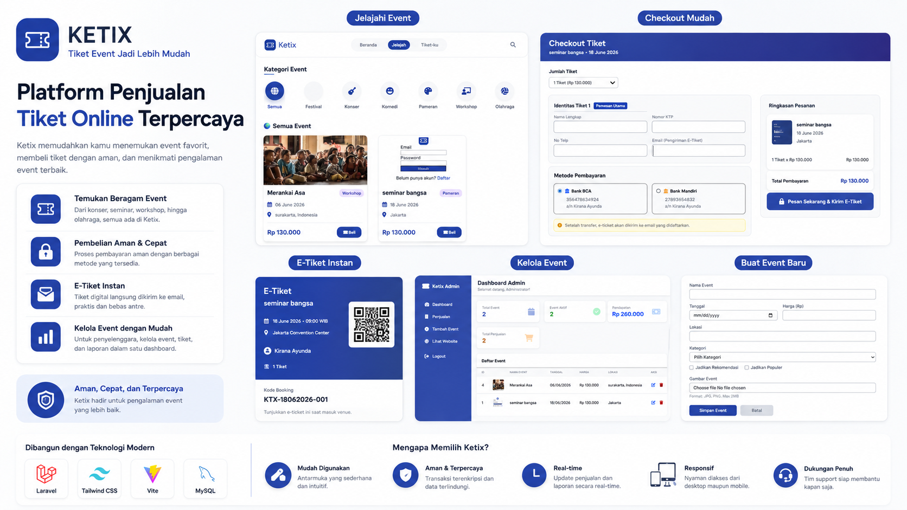
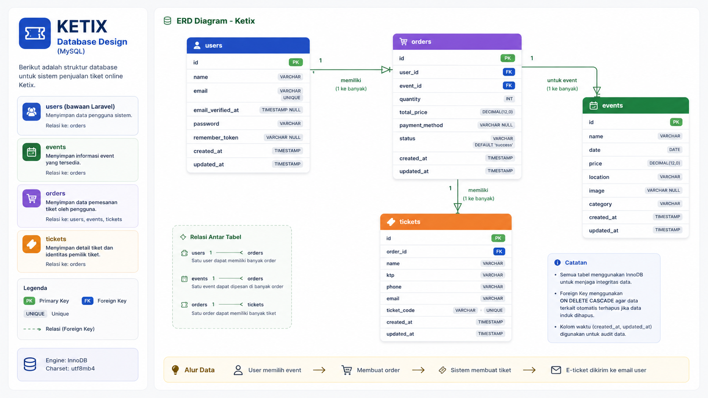

# 🎟️ Ketix — Online Ticket Sales Platform 🚀
---

---
Ketix adalah platform **penjualan tiket event online** yang membantu pengguna menemukan event favorit 🎉, melakukan checkout dengan mudah 🛒, memilih metode pembayaran 💳, dan menerima **e-ticket otomatis** ✉️.

Admin juga dapat mengelola event serta melihat data penjualan melalui dashboard 📊.

---

# ⚙️ Teknologi Yang Digunakan

## 🎨 Frontend
- Laravel Blade
- Tailwind CSS
- Vite

## 🧠 Backend
- Laravel

## 🗃️ Database
- MySQL (InnoDB)

## ✨ Fitur Tambahan
- Authentication 🔐
- Relasi Database 🔗
- Upload Gambar 🖼️
- Generate E-Ticket 🎫
- Checkout & Payment Method 💸
- Dashboard Admin 📈

---

# 📚 Struktur Database
---



| Table | Description |
|--------|-------------|
| `users` | Menyimpan data akun pengguna (nama, email, password, dan data autentikasi). |
| `events` | Menyimpan informasi event seperti nama, tanggal, harga, lokasi, gambar, dan kategori. |
| `orders` | Menyimpan data pemesanan tiket yang dilakukan user. |
| `tickets` | Menyimpan detail tiket dan identitas pemilik tiket. |

---

# 🔄 Alur Sistem

👤 User Login  
⬇️  
🎪 Pilih Event  
⬇️  
🛒 Buat Order  
⬇️  
💳 Pilih Metode Pembayaran  
⬇️  
🗃️ Data Tersimpan  
⬇️  
🎫 Sistem Generate Ticket  
⬇️  
📩 E-Ticket Dikirim ke Email  

---

# 🚀 Cara Menjalankan

## 1. Clone Project
```bash
git clone <repository-url>
cd ketix
```

## 2. Install Dependency
```bash
composer install
npm install
```

## 3. Setup Environment
```bash
cp .env.example .env
```

Edit database:

```env
DB_DATABASE=ketix
DB_USERNAME=root
DB_PASSWORD=
```

---

## 4. Generate Key
```bash
php artisan key:generate
```

---

## 5. Jalankan Migrasi Database
```bash
php artisan migrate
```

---

## 6. Jalankan Project
Terminal 1:
```bash
npm run dev
```

Terminal 2:
```bash
php artisan serve
```

Buka:

```text
http://127.0.0.1:8000
```

---

# 🏆 Keunggulan

✨ Desain modern dan bersih  
⚡ Checkout cepat  
🎫 E-ticket otomatis  
🔒 Data lebih aman  
📊 Dashboard admin mudah dipahami  
🗄️ Struktur database rapi  
📱 Responsif di berbagai perangkat  
🚀 Mudah dikembangkan lagi  

---

# 📝 Catatan

🧩 Semua relasi menggunakan **Foreign Key**  
🗑️ Delete otomatis memakai **Cascade**  
🕒 Kolom `created_at` dan `updated_at` dipakai untuk audit data  

---

💙 Dibuat dengan semangat membangun sistem tiket yang **cepat, modern, dan menyenangkan** 🎟️✨

© Ketix Ticketing Platform