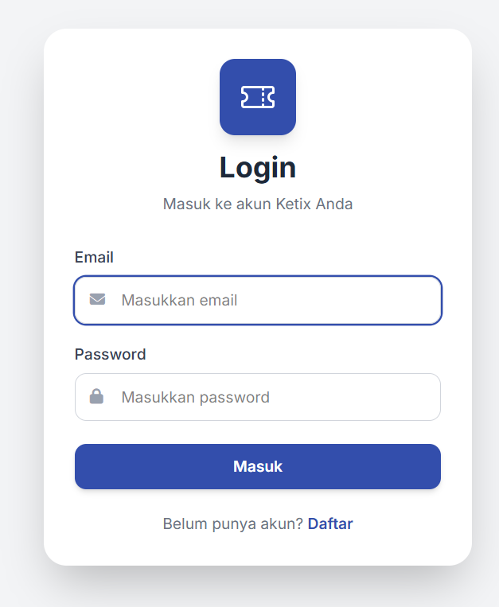
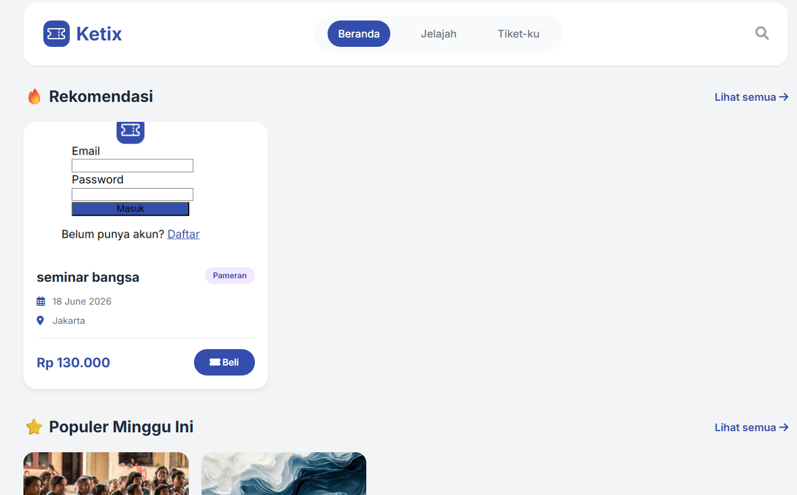
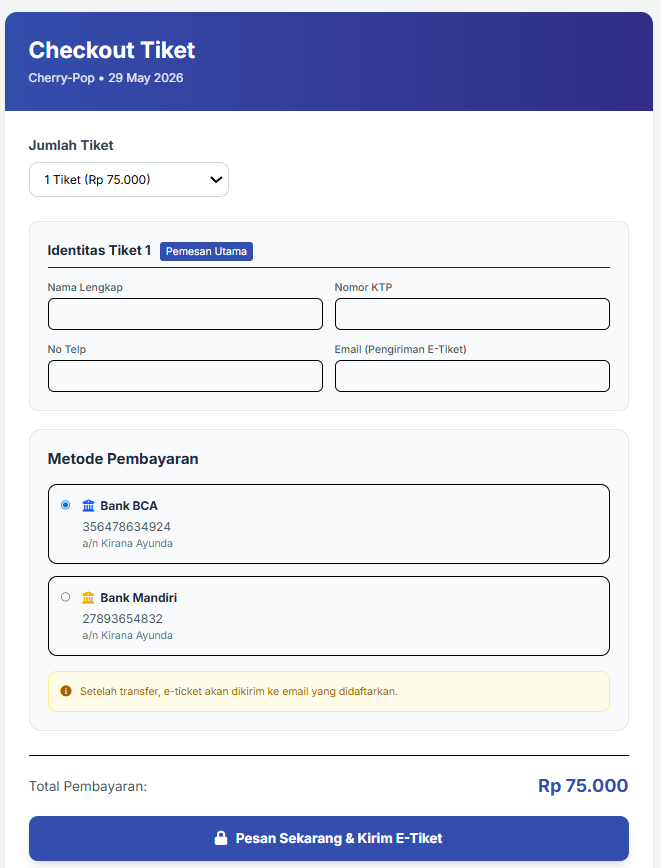

# 🎟️ Ketix - Website E-Commerce Pembelian Tiket


## 📖 Deskripsi Singkat

**Ketix** adalah website e-commerce pembelian tiket online yang memudahkan pengguna untuk memesan tiket event, konser, bioskop, seminar, dan berbagai acara lainnya secara cepat dan praktis.  
Website ini memiliki tampilan modern, responsif, dan user-friendly sehingga pengguna dapat melakukan pemesanan tiket dengan nyaman.
---

# 🖼️ Tampilan Website

## 🔑 Halaman Login

<p align="center">
  
</p>

Halaman login digunakan untuk autentikasi pengguna sebelum masuk ke dalam sistem Ketix.

---
## 🏠 Halaman Beranda

<p align="center">
  
</p>

Halaman utama yang menampilkan berbagai event dan tiket yang tersedia untuk dibeli.

---
## 📋 Create Order Table
| Field       | Tipe Data | Deskripsi          |
| ----------- | --------- | ------------------ |
| id          | bigint    | ID unik order      |
| user_id     | foreignId | Relasi ke pengguna |
| event_id    | foreignId | Relasi ke event    |
| quantity    | integer   | Jumlah tiket       |
| total_price | decimal   | Total pembayaran   |
| status      | string    | Status transaksi   |
| created_at  | timestamp | Waktu dibuat       |
| updated_at  | timestamp | Waktu diperbarui   |

Fitur create order memungkinkan pengguna memilih tiket, jumlah pembelian, serta melihat detail pesanan secara langsung.

---
## 💳 Halaman Checkout

<p align="center">
  
</p>

Halaman checkout digunakan untuk menyelesaikan transaksi pembelian tiket dengan metode pembayaran yang tersedia.

---
# 🚀 Cara Menjalankan Project

```bash
# Clone repository
git clone https://github.com/username/ketix.git

# Masuk ke folder project
cd ketix

# Jalankan project